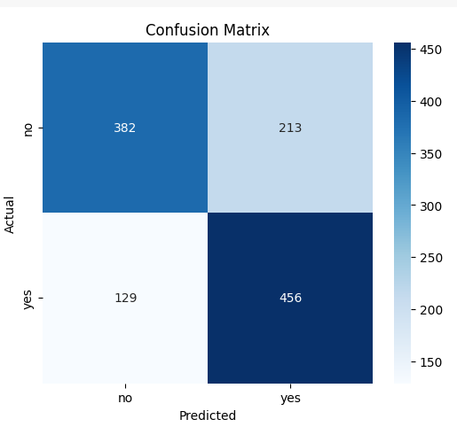
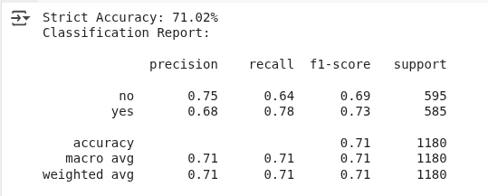
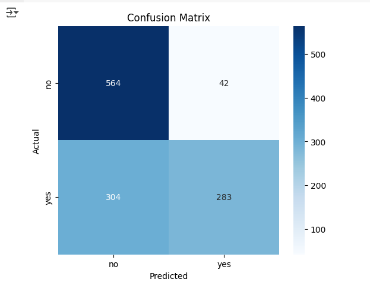
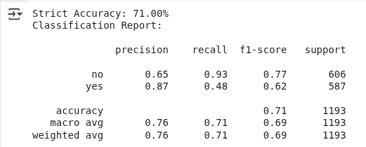

# Quantitative Analysis

## GPT-4o

closed-ended questions in sample: 1299  
rows discarded: 119 (expected answer or model answer is not yes/no)  
valid rows: 1180  
yes: 585  
no: 595

### Confusion Matrix



### Classification Report



### F1 Score by Question Type

```
   question_type  f1_score
5          ORGAN  0.967742
4       MODALITY  0.960000
7          PLANE  0.925373
8            POS  0.833333
1         ATTRIB  0.819672
6          OTHER  0.754098
9           PRES  0.706815
3          COUNT  0.666667
11          SIZE  0.662500
2          COLOR  0.600000
0            ABN  0.541667
10          PRSE  0.000000
```

## Qwen 2.5 VL 7b

closed-ended questions in sample: 1299  
rows discarded: 106 (expected answer or model answer is not yes/no)  
valid rows: 1193  
yes: 587  
no: 606

### Confusion Matrix



### Classification Report



### F1 Score by Question Type

```
   question_type  f1_score
4       MODALITY  0.924731
7          PLANE  0.906250
5          ORGAN  0.857143
3          COUNT  0.833333
1         ATTRIB  0.636364
8            POS  0.625000
9           PRES  0.575406
11          SIZE  0.495575
2          COLOR  0.461538
6          OTHER  0.439024
0            ABN  0.411765
10          PRSE  0.000000
```

## Llama 3.2 Vision 11b

closed-ended questions in sample: 1299  
rows discarded: 226 (expected answer or model answer is not yes/no)  
valid rows: 1073  
yes: 528  
no: 545

### Confusion Matrix


### Classification Report


### F1 Score by Question Type

```
   question_type  f1_score
4       MODALITY  0.696970
5          ORGAN  0.666667
3          COUNT  0.545455
6          OTHER  0.536585
7          PLANE  0.523810
9           PRES  0.445013
0            ABN  0.437500
11          SIZE  0.420000
8            POS  0.375000
2          COLOR  0.320000
1         ATTRIB  0.294118
10          PRSE  0.000000
```
